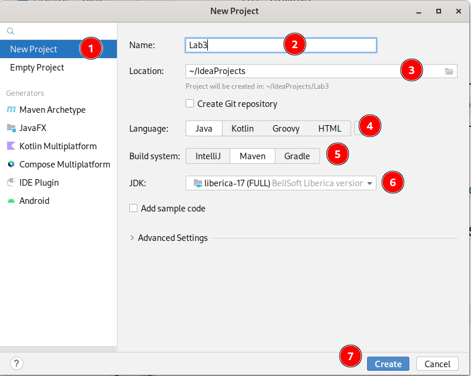
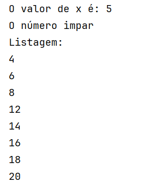
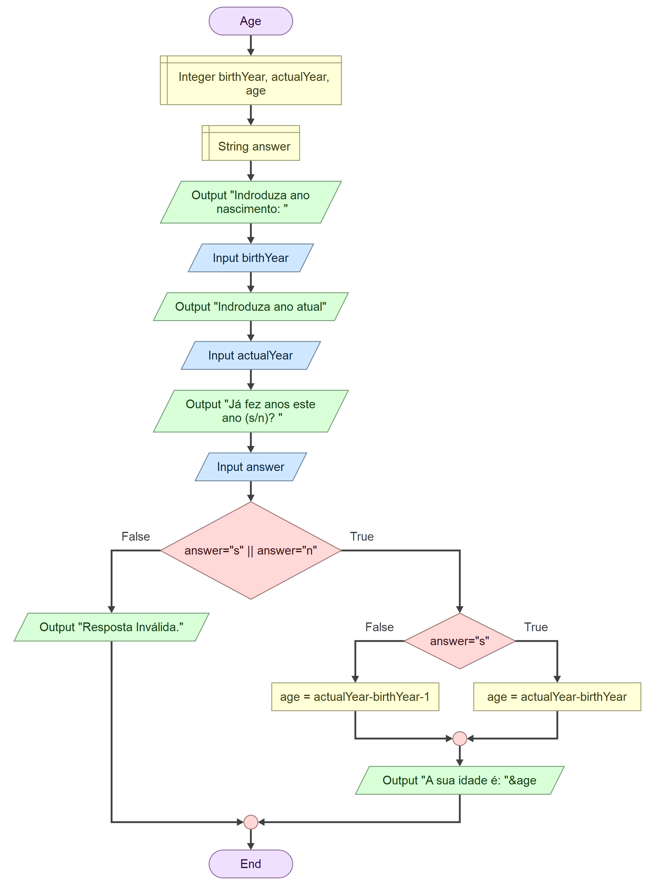
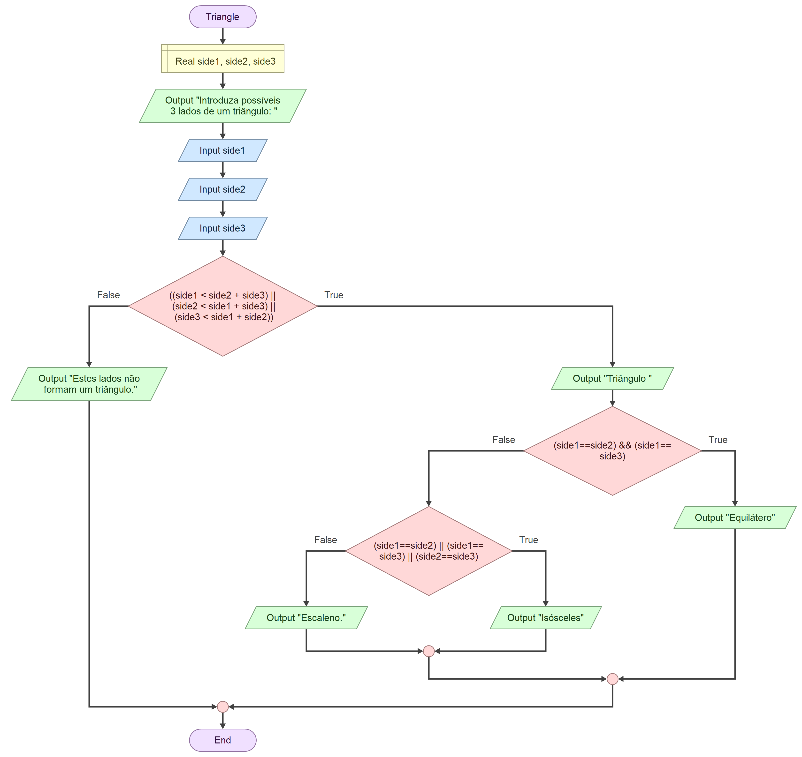
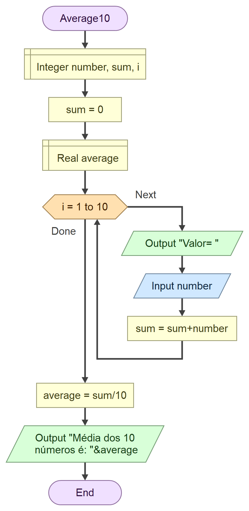
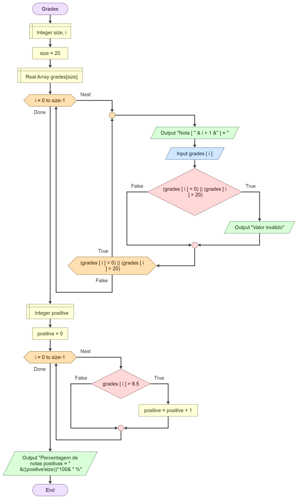

# Lab 3 - Introdução à Linguagem Java (Sintaxe)

## Aplicações Java no IDE JetBrains IntelliJ 

Deverá desenvolver os seguintes programas com recurso ao IDE `IntelliJ IDEA`.

- Na tela inicial ou através de `File > New > Project...` chegará ao _wizard_ de configuração de um novo projeto: 

    

- Configure o seguinte:

    1. `New Project` - isto irá criar uma estrutura inicial de diretórios para a pasta do projeto;

    2. O nome do projeto, e.g., `Lab3`;

    3. A pasta do seu sistema de ficheiros onde será criado o projeto (uma pasta);

    4. `Java`, como a linguagem de programação a utilizar;

    5. `Maven` como sistema de compilação e gestor de dependências;

    6. A JDK a utilizar; a instalada durante o Lab0.

    7. `Create`.

:bulb: Poderá carecer de adaptação, consoante linguagem do SO e/ou versão do IntelliJ.

### Criação e execução de programas

:warning: Dado que vamos criar vários pequenos programas, não valerá a pena a criação de projetos independentes. Irá criar programas separados em _classes_ separadas.

- Na janela do projeto, clique com o botão direito rato na pasta `src/main/java`e selecione `New > Java Class`, dê um nome à classe (considere a que está no início do fluxograma de cada exercício).

- No editor, digite a estrutura inicial de um programa em Java, e.,g.:

   ```java
   public class Age {
       public static void main(String[] args) {
          
       }
   }
   ```

- Para executar o programa clique com o botão direito em qualquer zona do editor de código e selecione `Run 'Age.main()'`.

:warning: Não se esqueça de guardar o seu trabalho! A aplicação permite guardar o "projeto" através de `File > Save All...`. Mais tarde, pode voltar a abri-lo no IDE. Sempre que tentar executar um programa, o ficheiro é automaticamente guardado.

## Exercícios :pen:


1. O programa seguinte tem erros **sintáticos** e erros **semânticos**:

    ```console
    public class SintaxeSemanticaExercicio {
    
        public static void main(String[] args) {
            int x = 5.0;  			/ Isto é um comentário
            System.out.println("O valor de x é:  + x);
    
            if (x % 2 = 0) {  
                System.out.println("O número é par");
            } else {
                System.out.println("O número impar")
            }
           
            System.out.println("Listagem: ");                         
            int valor = 2; 
            while (valor > 20){       
           		valor=+2;
            	if (numero == 10) {
              	  break;
           	    }
             System.out.println(valor);
            }
        }
    }
    ```
    
    </small></small></small><br/>
    
    🅰️ Sem recorrer ao IDE identifique os erros existentes;
    
    🅱️ De seguida, crie um programa no IDE com o código fornecido acima e faça as correções necessárias para que seja produzido o *output* seguinte:
    
    

---

2. Converta o fluxograma seguinte (`Age`) para um programa em Java. 
   
    <br/>

    :thinking: Analise o algoritmo e entenda o que faz antes de o codificar.

    

---

3. Converta o fluxograma seguinte (`Triangle`) para um programa em Java. .  
   
   <br/>

   :thinking: Analise o algoritmo e entenda o que faz antes de o codificar.

    

---

4. Converta o fluxograma seguinte (`Average10`) para um programa em Java. 

    <br/>
    :thinking: Analise o algoritmo e entenda o que faz antes de o codificar.

    
    
    

---

5. Converta o fluxograma seguinte (`Grades`) para um programa em Java. 

    <br/>
    :thinking: Analise o algoritmo e entenda o que faz antes de o codificar.
    
    

---

paula.miranda@estsetubal.ips.pt e bruno.silva@estsetubal.ips.pt